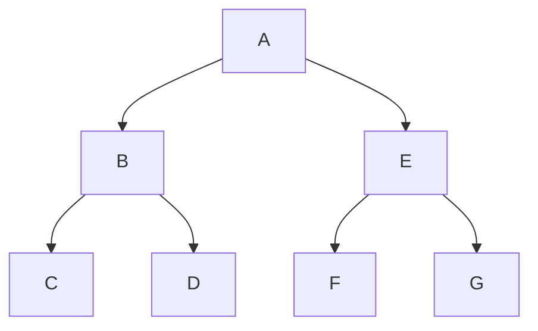
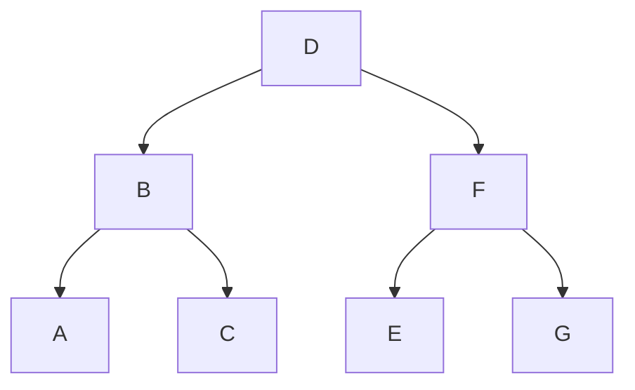
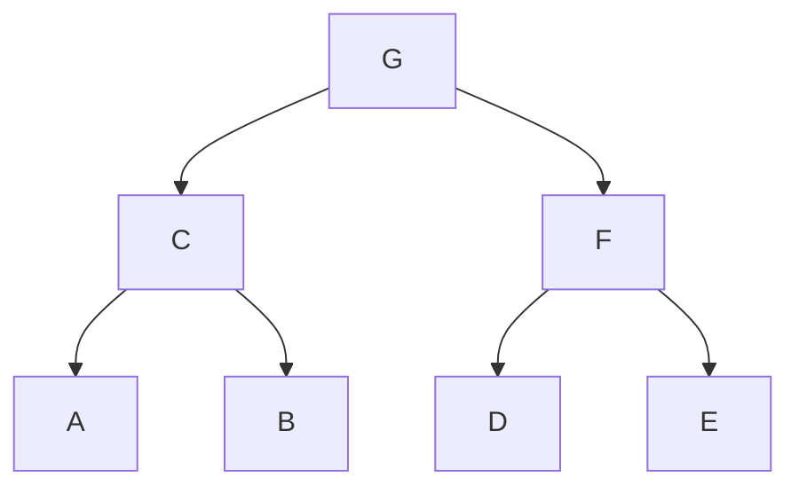

#technical #algorithm 

## Overview

Refer to [[Trees]] for more information.

### Depth First Traversals
 - These are implemented through [[Recursion]]
 - Implicitly uses [[Stacks]] (LIFO order) through the use of stack calls

[[#Pre-Order]]
[[#In-Order]]
[[#Post-Order]]

### Breadth First Traversals
 - Uses [[Queues]] (FIFO order)

[[#Level Order]]

>[!tip] Remember
>Depth-first traversals can be done without explicitly using a stack data structure because of the way programming languages call instructions through stacked memory calls. However, you need to explicitly use the queue data structure for breadth-first traversals.

---

## Pre-Order

ROOT --> LEFT --> RIGHT

```python
def preOrder(node):
	print(node) # root
	preOrder(node.left) # go left
	preOrder(node.right) # go right

# Output: A B C D E F G
```




---

## In-Order

LEFT --> ROOT --> RIGHT

```python
def inOrder(node):
	inOrder(node.left) # go left
	print(node) # root
	inOrder(node.rigt) # right

# Output: A B C D E F G
```




---

## Post-Order

LEFT --> RIGHT --> ROOT

```python
def postOrder(node):
	postOrder(node.left) # go left
	postOrder(node.right) # go right
	print(node) # root

# Output: A B C D E F G
```




---

## Level Order

#todo order

```python
```

```mermaid
```

