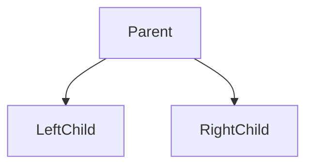
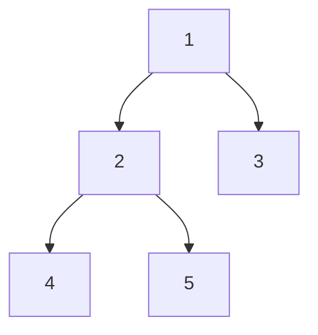
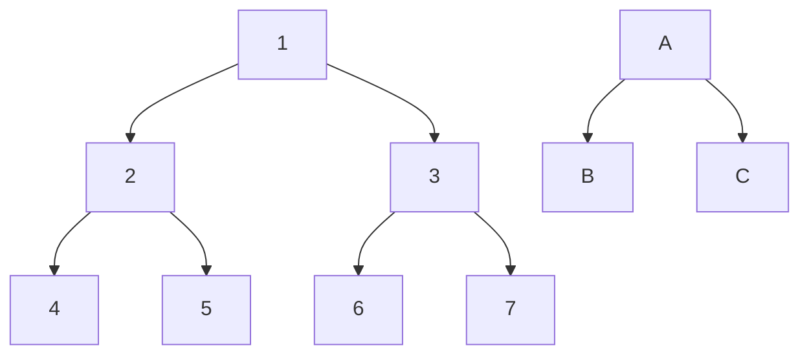

#technical #data-structure 

## Overview
 - A binary tree is a tree data structure in which each parent node can have at most two children `(0|1|2)`.



---

## Types of Binary Tree

### Full Binary Tree
Every node has either two or no children


### Perfect Binary Tree
Every node has exactly two child nodes and all the leaf nodes are at the same level



### Complete Binary Tree
#todo 

### Balanced Binary Tree
The height of the left and right sub-tree of any node must not differ by more than 1


> Here, height difference of nodes is at most 1 (at root node)

---

## How to solve almost any Binary Tree problem?

1. Find the base case (usually found at the leaves)
2. Call the same function on left sub-tree
3. Call the same function on right sub-tree
4. Evaluate the results

```python
def treeSum(root):
	# Step 1: base case
	if root is None:
		return 0
	else:
		leftSum = treeSum(root.left) # Step 2: left
		rightSum = treeSum(root.right) # Step 3: right
		return root.value + leftSum + rightSum # Step 4: eval
```

If you look closely, this is basically [[Tree Traversals#Post-Order|Post-Order Traversal]] !


---

## Operations

### Insertion

### Removal

### Search

### Traversal
[[Tree Traversals]]

---

## Use Cases

### Find Tree Height

### Find Node Level

### Find Size of Tree