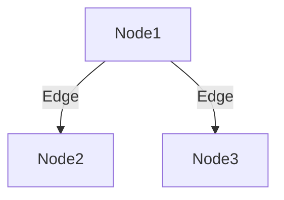

#technical #data-structure 

## Overview
- Trees are a non-linear data structure
- Different tree data structures allow quicker and easier access to the data as it is a non-linear data structure.

### Terminology
 - <u>Node</u>: A node is an entity that contains a value and pointers to its child nodes.
 - <u>Edge</u>: It is the link between any two nodes.
 - <u>Root</u>: Topmost node of a tree
 - <u>Degrees</u>: Total number of branches of a node

#### Height vs Depth

![[Pasted image 20230723143519.png]]
- The **depth** of a node is the number of edges from the node to the tree's root node.
	- Depth of root = 0
- The **height** of a node is the number of edges from the node to a leaf.
	- Height of leaf = 0

### Basics of Tree
[[Tree Traversals]]
[[Depth First Search]]
[[Binary Trees]]